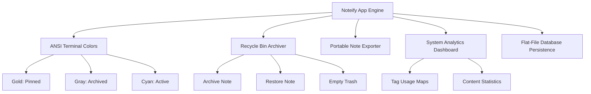

# 📓 Noteify: C++ Premium CLI Note Management System

[](https://en.cppreference.com/w/cpp/17)
[](https://en.wikipedia.org/wiki/Multi-platform)
[](https://en.wikipedia.org/wiki/ANSI_escape_code)
[](https://opensource.org/licenses/MIT)

> **Noteify** is a zero-dependency, professional-grade C++ terminal-based note-taking application. Combining high-performance C++17 OOP structure, dynamic ANSI terminal color rendering, data-driven analytics, and a non-destructive Recycle Bin workflow, Noteify raises the bar for command-line productivity.

---

## ✨ Features & Highlights



### 🎨 Premium ANSI Terminal Colors
* Native escape-sequence console colorizer.
* Dynamic, state-driven color cards:
  * 🌟 **Gold Bold**: Highlights Pinned (Priority) note documents.
  * 📁 **Vibrant Cyan**: Renders default active workspace views.
  * 🗑️ **Muted Slate Gray**: Identifies archived notes in the Recycle Bin.
* Implements a **Windows Console Virtual Terminal Hook** to natively support ANSI colors on standard Windows shells.

### 🗑️ State-Driven Recycle Bin (Trash Dashboard)
* **Non-Destructive Archiving**: Moving a note to the Trash marks it as archived, removing it from standard views and searches without erasing the file from the database.
* **Restore & Recover**: Seamlessly restore notes from the Recycle Bin back to active notebook folders.
* **Erase-Remove Idiom**: Safe, efficient bulk-erasing tools to empty the recycle bin and permanently free up workspace storage.

### 📤 Portable Document Exporter
* Generates professionally formatted, standalone `.txt` documents out of Noteify.
* Automatically sanitizes text titles to create filesystem-safe filenames.
* Appends metadata headers, tags, word counts, and character lengths to exported files.

### 📊 System-Wide Analytics Dashboard
* Leverages C++ Standard Template Library (`std::map`) to perform tag frequency mapping.
* Calculates metrics such as average word length, character densities, active notebook loads, and tag lists.

### 💾 Backwards-Compatible Persistence Layer
* Fully robust, pipe-delimited flat-file file-system databases.
* Automatically detects and upgrades legacy database definitions (5-token) to modern, archive-aware structures (6-token) with zero user intervention required.

---

## 🛠️ System Architecture

Noteify follows a decoupled **Object-Oriented Design**:

* **`User` (Domain Entity)**: Represents the author and handles authentication identities.
* **`Note` (Domain Entity)**: Manages properties, dynamic tags, content, timestamps, word counts, and the visual character-wrapping visual border engine.
* **`Notebook` (Collection Entity)**: Acts as directory folders, controlling notes, custom search filters, sorting, and archival vectors.
* **`NoteService` (System Orchestrator)**: Controls dynamic databases, saves and loads user lists, manages folder mappings, generates unique note IDs, exports notes, and processes analytics.
* **`main.cpp` (System Shell)**: Coordinates terminal states, loops input buffers, protects against input streams skipping, and runs the menu loop.

---

## 🚀 Getting Started

### 📋 Prerequisites
Ensure you have a modern C++ compiler supporting **C++17** (such as GCC/g++, Clang, or MSVC).

### ⚙️ Installation & Compilation

1. **Clone the Repository**:
   ```bash
   git clone https://github.com/your-username/Noteify.git
   cd Noteify/ManageNoteSystem
   ```

2. **Compile the Application**:
   * **Windows/Linux/macOS (GCC/g++)**:
     ```bash
     g++ -Wall -std=c++17 main.cpp User.cpp Note.cpp Notebook.cpp NoteService.cpp -o ManageNoteSystem
     ```
   * **Using Microsoft Visual Studio (MSVC)**:
     Compile using the project build tools or visual solutions, ensuring `/std:c++17` compiler flag is set.

3. **Launch the Program**:
   * **Windows CLI**:
     ```cmd
     ManageNoteSystem.exe
     ```
   * **Linux / macOS**:
     ```bash
     ./ManageNoteSystem
     ```

*Alternatively, Windows users can simply double-click **`Run.bat`** to compile on-the-fly and execute Noteify automatically!*

---

## 📖 Guide to Codebase (Structural Map)
* **[`User.h`](/ManageNoteSystem/User.h) / [`User.cpp`](/ManageNoteSystem/User.cpp)**: Auth models and credentials.
* **[`Note.h`](/ManageNoteSystem/Note.h) / [`Note.cpp`](/ManageNoteSystem/Note.cpp)**: Note components and wrapping border layout algorithms.
* **[`Notebook.h`](/ManageNoteSystem/Notebook.h) / [`Notebook.cpp`](/ManageNoteSystem/Notebook.cpp)**: Notebook container operations and recycle logic.
* **[`NoteService.h`](/ManageNoteSystem/NoteService.h) / [`NoteService.cpp`](/ManageNoteSystem/NoteService.cpp)**: Database engines, note exporters, and tag analysis dashboards.
* **[`main.cpp`](/ManageNoteSystem/main.cpp)**: Console menu buffers and Windows VT API initialization.
* **[`EXPLANATION.md`](/ManageNoteSystem/EXPLANATION.md)**: Deep-dive educational line-by-line code explanation.

---

## 📄 License
This project is licensed under the MIT License - see the [LICENSE](LICENSE) file for details.

---

*Crafted with 💖 in C++17 by Pinto & Antigravity*
